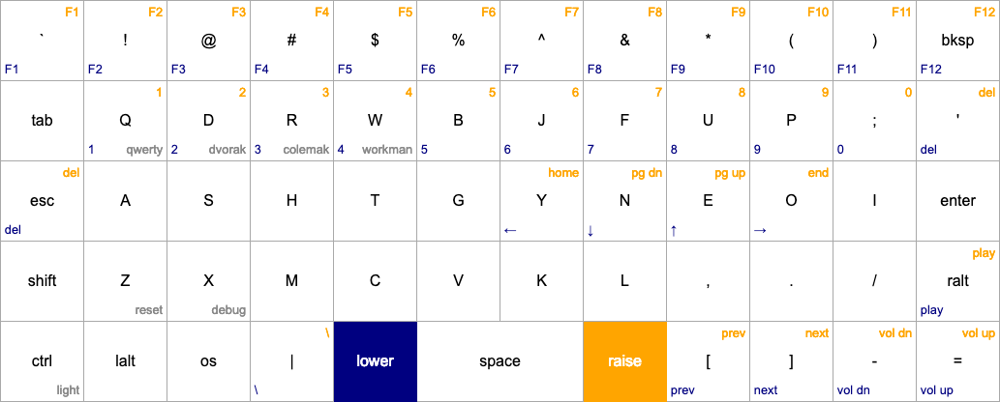
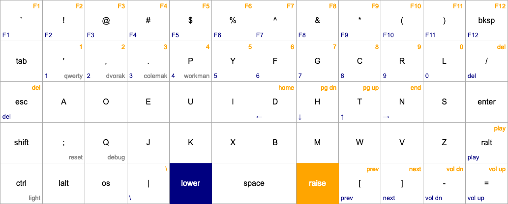

# devman

Based on the default preonic layout, it adds the workman layout as default.
* The top row keys are symbols (`!`, `@`, `$`, etc.)
* The numbers are on the second row from the top (with `lower` or `raise`)
* Function keys (`F1`, `F2`, etc.) are accessible on the `lower` and the `raise`
  layer in the top row
* Arrows are in the home row (with `lower`)
* `[`, `]`, `-`, `=` are on bottom right corner
* `Enter` is in the home row
* I added `R-Alt` just below `Enter`, I use it as compose key on Linux.

## Workman

## Qwerty

## Colemak

## Dvorak

